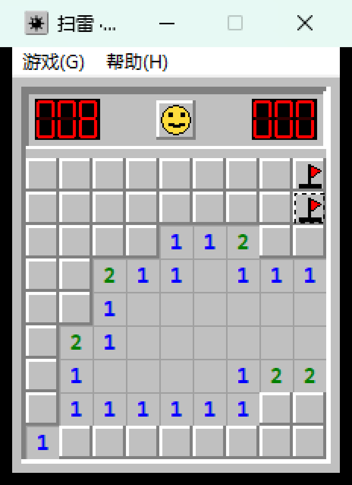
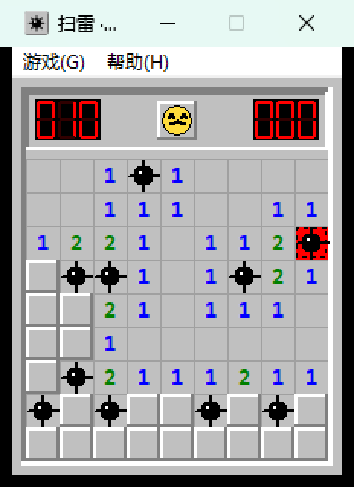
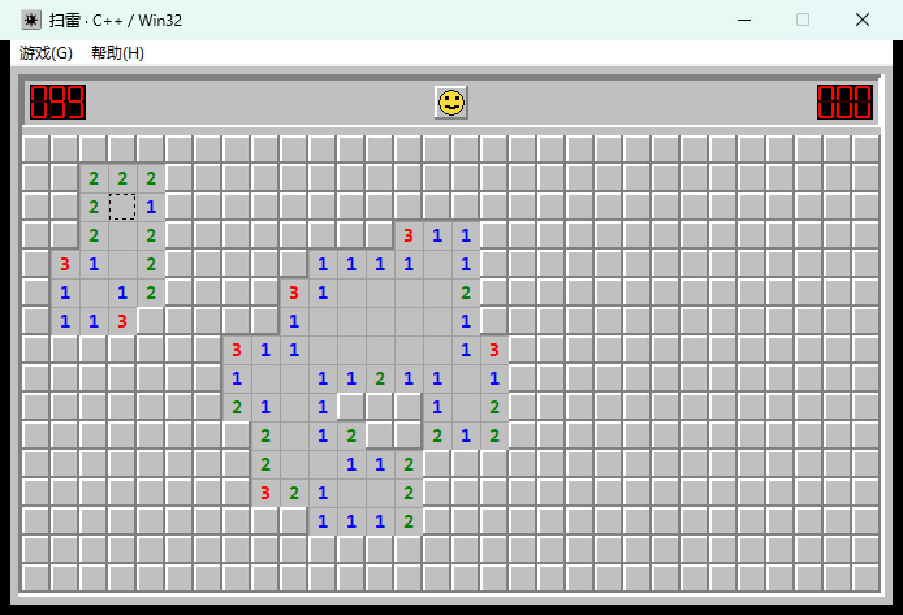
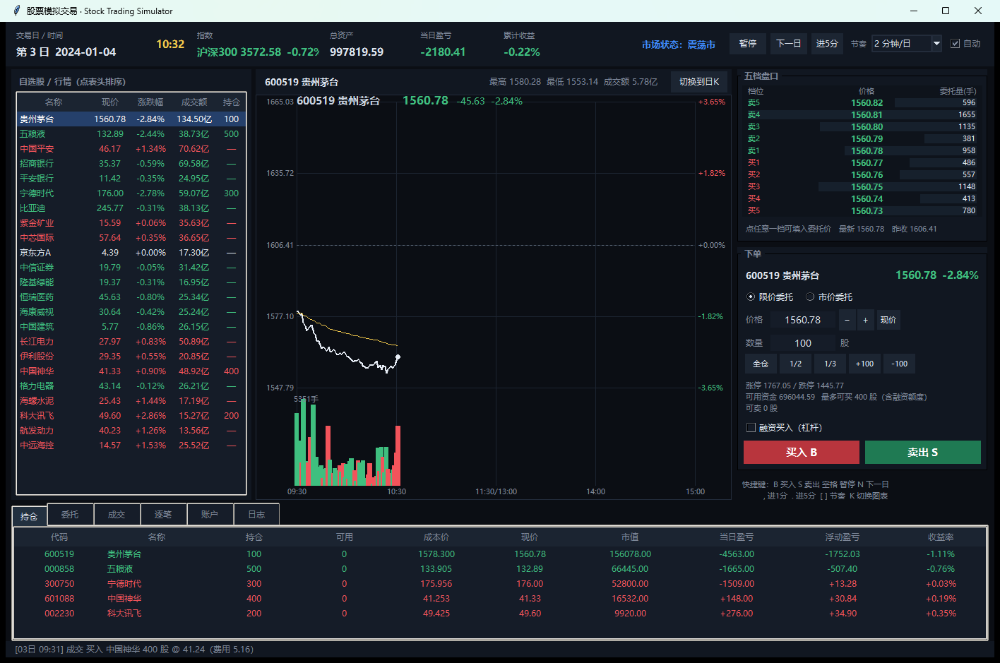

# 小游戏合集 · Mini Games

三个从零手写的完整游戏，技术栈各不相同。都不是 demo——能直接双击玩，也都有单元测试和打包脚本。

| 项目 | 技术栈 | 代码量 | 一句话 |
|---|---|---|---|
| 🎮 **[扫雷](minesweeper_cpp/)** | **C++20 + 原生 Win32/GDI** | 1735 行 | 零第三方依赖、**零图片资源**（图标、7 段数码管、笑脸按钮、3D 格子全是代码画的），逻辑与界面彻底分层，**441 万项断言**的单元测试 |
| 📈 **[股票模拟交易](stock_game/)** | **Python + tkinter** | 3087 行 | 尽可能贴近 A 股实盘：涨跌停 / T+1 / 佣金印花税 / 滑点与冲击成本 / 限价挂单 / 部分成交 / 融资强平；五档盘口、逐笔成交、分时与日K |
| 🧱 **[俄罗斯方块](tetris.py)** | **Python + tkinter** | 688 行 | 60FPS 增量渲染（元素复用不重建）、幽灵落点、暂存 Hold、7-bag 随机、自绘 DAS/ARR 连发手感 |

---

## 🎮 扫雷（C++ / Win32）

纯 Win32 API + GDI 实现，**没有第三方库，也没有任何图片资源**——图标是多尺寸 ICO 生成器手写的，
7 段数码管、笑脸（正常/惊讶/死亡/胜利四种表情）、雷、旗全部用 GDI 图元绘制。



**特性**

- 三种难度 + 自定义（5~50 列 × 5~30 行，雷数上限自动算）
- **首点安全**：第一次点击的 3×3 范围保证无雷
- **和弦**：左右键同按/中键，数字周围旗数正确时一次展开其余邻格；旗插错了照样炸
- 洪水展开用显式栈实现，30×16 也不会爆栈
- 成绩写注册表，破纪录弹窗
- 双缓冲绘制无闪烁；Per-Monitor V2 DPI 感知；静态链接 CRT（`/MT`）；`/W4` 零告警

**构建与测试**

```powershell
powershell -ExecutionPolicy Bypass -File .\minesweeper_cpp\build.ps1   # 自动定位 MSVC，编译 + 跑自测
```

需要 Visual Studio 2022/2026（含 C++ 桌面开发负载）。`tests.exe` 覆盖 11 组用例约 441 万项断言：
首点安全、洪水展开不动点、和弦、胜负判定、状态机、边界、同种子可复现、400 局随机对局不变量。

<details>
<summary>更多截图</summary>




</details>

---

## 📈 股票模拟交易（Python / tkinter）

重点全在**"像不像真的"**上，而不是画面好看。



**交易规则（A 股）**

| 规则 | 实现 |
|---|---|
| 涨跌停 | 主板 ±10%、创业板/科创板 ±20%、ST ±5%；一字板买不到、卖不出，封板缩量 |
| T+1 | 当日买入次日才可卖，"持仓"与"可卖"分开 |
| 申报单位 | 主板/创业板 100 股整数倍；科创板 200 股起、超过部分 1 股递增；零股需一次卖完 |
| 费用 | 佣金万 2.5（**单笔最低 5 元**）、印花税千 0.5（仅卖出）、过户费 0.001% |
| 废单 | 限价高于涨停价/低于跌停价直接拒单；市价买入按**涨停价冻结资金** |
| 委托 | 收盘未成交自动失效；市价单按 IOC（即时成交剩余撤销） |

**撮合（最容易做假的地方）**

- **绝不偷价**：下单只由"下单之后的下一根分钟线"撮合，不会拿已经走完的行情成交
- 限价单跳空以更优价成交，未触及就挂着；**滑点 + 冲击成本**按下单量占该分钟成交量比例计算
- 按最小价位让价取整（买向上、卖向下）；单分钟最多吃该分钟成交量的 10%，超出部分部分成交

**行情模型**

- 三层收益分解：市场因子（牛/熊/震荡马尔可夫状态机）× beta + 个股特质波动，全部在对数收益空间
- 波动率标定到目标值（实测沪深300 18.4% vs 目标 18%，个股偏差中位数 5%）
- 日内 U 型放量、隔夜跳空、封板缩量、**五档盘口**（最新价贴买一或卖一，封涨停卖盘挂空）、**逐笔成交明细**
- 新闻分宏观/行业/个股三级，带期限叠加、到期失效
- 23 只标的、21 个行业，指数由成分股流通市值加权实时合成

**账户与风控**：持仓成本含费用；已实现/浮动盈亏分开；融资 1 倍杠杆、年利率 6.5% 每日计息、
卖出所得优先还款、担保比例 <130% 预警 / <110% **强制平仓**。
恒等式 `总资产 = 初始资金 + 已实现 + 浮动 − 累计利息` 在自测中**逐分钟校验**。

**运行**

```powershell
py stock_game_gui.py                # 源码运行
py -m stock_game --self-test        # 无界面自测（8 项，含 60 日长跑）
powershell -ExecutionPolicy Bypass -File .\build_stock_exe.ps1   # 打包（onedir，启动 0.4 秒）
```

完整说明见 [股票模拟交易说明.md](股票模拟交易说明.md)。

---

## 🧱 俄罗斯方块（Python / tkinter）

单文件、零依赖，重点在**手感**：固定 60FPS 渲染与重力解耦，画布元素一次创建后只改坐标
（不做整屏重建），长按左右/下由自绘 DAS/ARR 驱动，绕开 Windows 按键重复的 500ms 延迟。

```powershell
py tetris.py
py tetris.py --self-test
```

---

## 仓库结构

```
.
├── minesweeper_cpp/          扫雷（C++ / Win32）
│   ├── src/                  game.h/game.cpp（纯逻辑，无 windows.h）、main.cpp（界面）、tests.cpp（测试）
│   ├── res/                  图标与版本信息资源
│   ├── docs/                 截图
│   └── build.ps1             一键编译（自动定位 MSVC）
├── stock_game/               股票模拟交易（Python 包）
│   ├── market.py             行情模拟：状态机、因子、涨跌停、盘口、逐笔、新闻、指数
│   ├── trading.py            委托校验、撮合、滑点冲击、部分成交、费用
│   ├── account.py            账户、成本、盈亏、冻结、融资负债、净值
│   ├── engine.py             主引擎：时间推进、收盘结算、风控强平
│   ├── charts.py             分时图 / 日K（均线、成交量、十字光标）
│   ├── ui.py                 tkinter 界面
│   └── selftest.py           无界面自测
├── tetris.py                 俄罗斯方块（单文件）
├── build_stock_exe.ps1       打包股票游戏（onedir/onefile 两模式）
├── build_exe.ps1             打包俄罗斯方块
└── .build/                   图标生成器、打包与验证脚本
```

## 关于打包

两个 Python 项目都用 PyInstaller 打包，构建脚本会在打包前**先跑自测**，不通过就中止。
股票游戏默认 onedir 模式（启动 0.4 秒），单文件模式启动约 2.5 秒（每次要自解压），
打包时还会裁掉用不到的标准库。

## 已知简化

- 股票游戏的行情**完全由模型生成**，用了真实公司名与代码方便代入，但与真实市场无关，**不构成投资建议**
- 股票游戏没有分红送转/除权除息、没有集合竞价、没有逐笔委托簿、不能融券做空
- 未做跨平台：扫雷是 Windows 专属（Win32/GDI），两个 Python 游戏依赖 tkinter

## License

MIT
